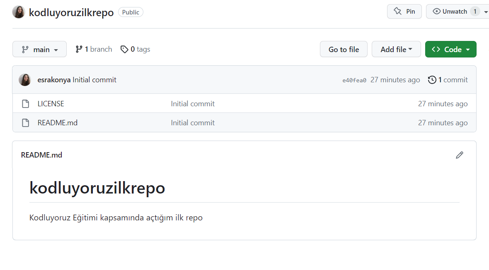

# Kodluyoruz Ilk Repo
-------------------------------------------------------------------------------------------------
Bu repo [Kodluyoruz](https://www.kodluyoruz.com) Front-End Eğitiminde oluşturduğumuz ilk repo. İçerisinde bir adet README dosyası, bir adet de index.html barındırıyor.



## Installation
-------------------------------------------------------------------------------------------------

Öncelikle projeyi clonelayın. (Buraya sizin reponuzdan aldığınız link gelecek)
```
git clone *git@github.com:esrakonya/kodluyoruzilkrepo.git*
```

## Usage
-------------------------------------------------------------------------------------------------

Projeyi cloneladıktan sonra Visual Studio Code programında açınız.

Windows için:
```
cd kodluyoruzilkrepo
code .
```

## Contributing
-------------------------------------------------------------------------------------------------

Pull requestler kabul edilir. Büyük değişiklikler için, lütfen önce neyi değiştirmek istediğinizi tartışmak için bir konu açınız.

## Licence
-------------------------------------------------------------------------------------------------

[MIT](https://choosealicense.com/licenses/mit/)
